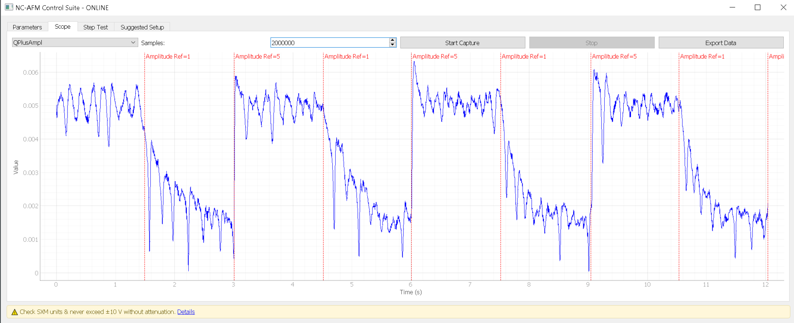
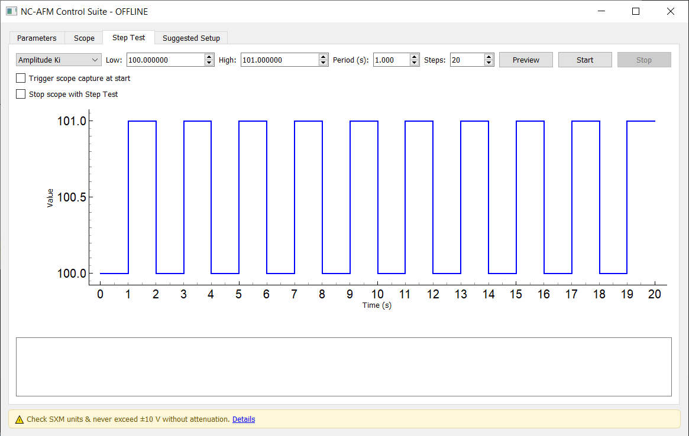
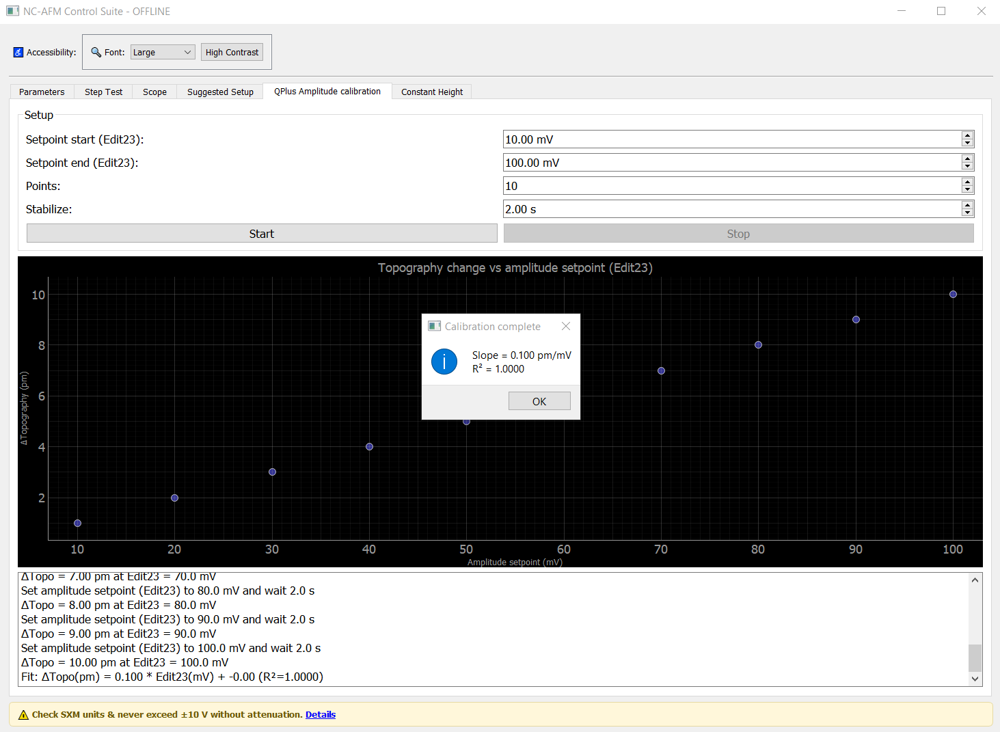

# NC-AFM Control GUI

A simple GUI for controlling NC-AFM parameters on Anfatec SXM controllers (Omicron systems). Interfaces with the SXM software via DDE to provide parameter adjustment, step testing, and real-time monitoring.

**Author**: Benjamin Mallada  
**Contact**: [benjamin.mallada@bioch.ox.ac.uk](mailto:benjamin.mallada@bioch.ox.ac.uk)  
**Website**: [benjaminmallada.com](https://www.benjaminmallada.com/)

**Acknowledgments**: This software builds heavily upon the scripts and documentation generously provided by Anfatec for interfacing with their SXM controllers. For additional SXM software support, see: https://www.anfatec.de/support/02_spm/sxm_softwaresupport.html

## Quick Start

### Step 1: Install Python
Download and install [Anaconda Python](https://www.anaconda.com/download). During installation, check "Add Anaconda to PATH" when prompted.

### Step 2: Set up the environment
Open **Anaconda Prompt** (Windows Start Menu) and run these commands one by one:

```bash
conda create -n sxm-ncafm python=3.11 pip
conda activate sxm-ncafm
```

### Step 3: Get the software and install dependencies

**IMPORTANT**: Using a dedicated environment with a proper package manager prevents conflicts with other Python software on your system. This is strongly recommended.

**Get the code first:**
- **Download ZIP (no git required)**: Go to https://github.com/Ex-libris/sxm_ncafm_control, click "Code" → "Download ZIP", extract to a folder
- **Using git**: `git clone https://github.com/Ex-libris/sxm_ncafm_control.git`

**Then install dependencies** (choose one method):

**Method A: Conda with environment.yml (recommended)**
```bash
cd sxm_ncafm_control
conda env update -f environment.yml
```

**Method B: Conda with individual packages**
```bash
cd sxm_ncafm_control
conda install pyqt5 pyqtgraph numpy scipy pywin32
```

**Method C: Pip (if using conda, activate environment first)**
```bash
cd sxm_ncafm_control
pip install -r requirements.txt
```

**Method D: Pure Python users (no conda)**
First create a virtual environment:
```bash
python -m venv sxm-ncafm-env
sxm-ncafm-env\Scripts\activate
cd sxm_ncafm_control
pip install -r requirements.txt
```

### Step 4: Run the GUI
From the parent directory (one level above the sxm_ncafm_control folder):
```bash
python -m sxm_ncafm_control.app
```

Or if you're inside the sxm_ncafm_control folder:
```bash
cd ..
python -m sxm_ncafm_control.app
```

The control window will open, ready to connect to your SXM software.

## Screenshots (Some of them are outdated!)

### Main Interface
NC-AFM Control GUI showing the tabbed interface for parameter control and monitoring. You can save tuning files or add extra parameters for tuning using the DDE service. The image referencing the EditXX windows is from the Anfatec manual 'Scanning Probe Controlling System -- SXM-Software 28.8. Language Description'


### Constant height
This tab gives direct control of the piezo absolute position. You can enable or disable the feedback loop and move closer or further from the sample manually using the keyboard, mouse, or by entering numbers. This control is essential for precise adjustment of the tip–sample distance and for accessing different regimes in high-resolution nc-AFM. (Image in OFFLINE mode - a.k.a no microscope, but I will add soon one with the microscope engaged.)


### Scope Tab
Real-time channel monitoring with direct driver communication. You can track in a given channel the effects of triggering step-tests. In this example, you can see the effects of a step-test for the Amplitude reference setpoint on the QPlusAmplitude signal. 



### Step Test Tab
Square step tests for ncAFM channels parameters. In this tab, you can define a train of step changes in a given parameter for the different PIDs controlling the ncAFM loop.



### Suggested setup Tab
Calculator of PLL parameters. You can also add a .txt or .csv with freq | phase | amplitude columns. This is based on the suggested tricks and rules of thumbs of the manual. This might need a bit or work!


### (Basic) Amplitude calibration
Get an idea of the calibration between the excitation signal you provide to the qplus (in mV), and the physical amplitude of oscillation. It uses STM constant current to see how much of a change of excitation corresponds to a topographycal STM change. 



### Operation
An example of the script running with SXM in the background. The scope improves substantially guessing/tuning parameters respect to the native oscilloscope.


## Usage
- Ensure your SXM software is running before starting the GUI
- The GUI communicates with SXM through DDE (Dynamic Data Exchange) for parameter control
- Real-time data acquisition uses ioctl calls to directly access the Anfatec controller's Windows driver, bypassing the SXM software to read oscilloscope channels with minimal latency
- Use the Parameters tab to adjust feedback settings
- Use Step Test tab to perform square wave tests
- Use Scope tab for real-time channel monitoring (data acquired directly from controller driver)

## Requirements
- Windows (required for SXM/DDE interface)
- Anfatec SXM software running
- Python 3.11+

## Troubleshooting
If the GUI fails to connect to SXM:
1. Verify SXM software is running
2. Check that DDE communication is enabled in SXM settings
3. Restart both SXM and the GUI

## Project Structure
```
sxm_ncafm_control/
├── app.py                                  # Main entry point
├── dde_client.py                           # SXM communication
├── device_driver.py                        # Low-level driver interface
├── common.py                               # Shared functions between the tabs
├── connection.py                           # Creation of the DDE and IOCTL connections
├── SXMRemote.py                            # DDE server creator and management of commands towards SXM
└── gui/                                    # GUI components
    ├── params_tab.py                       # Parameter adjustment
    ├── step_test_tab.py                    # Square wave testing
    ├── suggested_tab.py                    # Setup suggestions
    └── scope_tab.py                        # Real-time monitoring
    └── gui_accessibility_manager.py        # Real-time monitoring
    └── main_window.py                      # Handles the connections between all the tabs and the GUI
    └── gui_accessibility_manager.py        # Helper to improve readibility of the whole GUI
    └── z_const_acquisition.py              # Control the z position of your piezo.
```
